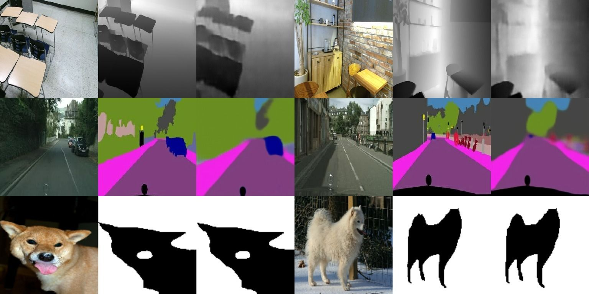

# tensor-to-image
[Website](https://yigitgunduc.github.io/tensor2image/) | [Arxiv](https://arxiv.org/abs/2110.08037)



## Abstract

Transformers gain huge attention since they are first introduced and have 
a wide range of applications. Transformers start to take over all areas of 
deep learning and the Vision transformers paper also proved that they can 
be used for computer vision tasks. In this paper, we utilized a 
vision transformer-based custom-designed model, tensor-to-image, 
for the image to image translation. With the help of self-attention, 
our model was able to generalize and apply to different problems without 
a single modification

## Setup

Clone the repo
```bash
git clone https://github.com/yigitgunduc/tensor-to-image/
```

Install requirements
```bash
pip3 install -r requirements.txt
```

> For GPU support setup `TensorFlow >= 2.4.0` with `CUDA v11.0 or above` 
> - you can ignore this step if you are going to train on the CPU

## Training

Train the model
```bash
python3 src/train.py
```
Weights are saved after every epoch and can be found in `./weights/`

## Evaluating

After you have trained the model you can test it against 3 different criteria 
(FID, Structural similarity, Inceptoin score). 

```bash
python3 src/evaluate.py path/to/weights
```

## Datasets

Implementation support 8 datasets for various tasks. 6 pix2pix datasets and two additional ones.
6 of the pix2pix dataset can be used by changing the `DATASET` variable on the `src/train.py`
for the additional datasets please see `notebooks/object-segmentation.ipynb` and 
`notebooks/depth.ipynb`

Dataset available thought the `src/train.py` 

- `cityscapes` 99 MB
- `edges2handbags` 8.0 GB
- `edges2shoes` 2.0 GB
- `facades`	29 MB
- `maps` 239 MB
- `night2day` 1.9 GB

Dataset available though the notebooks

- `Oxford-IIIT Pets` 
- `RGB+D DATABASE`

## Cite
If you use this code for your research, please cite our paper [Tensor-to-Image: Image-to-Image Translation with Vision Transformers](https://arxiv.org/abs/2110.08037)
```           
@article{gunducc2021tensor,
  title={Tensor-to-Image: Image-to-Image Translation with Vision Transformers},
  author={G{\"u}nd{\"u}{\c{c}}, Yi{\u{g}}it},
  journal={arXiv preprint arXiv:2110.08037},
  year={2021}
}
```
